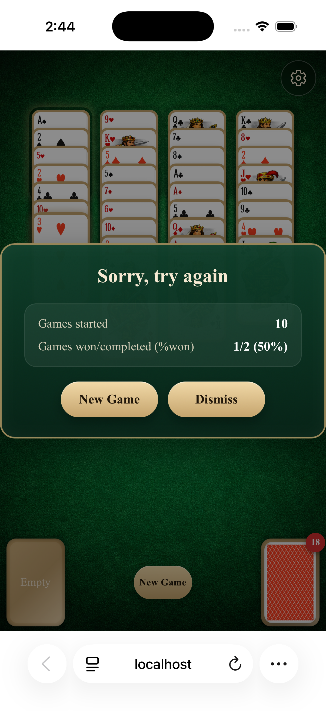
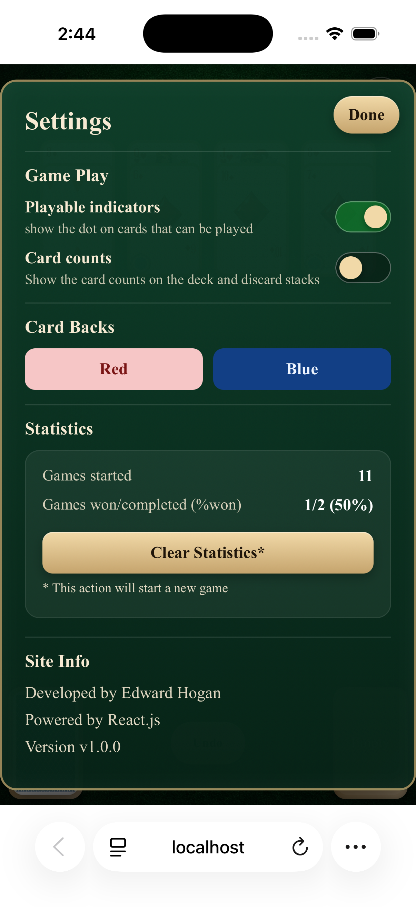

# Aces Up (React)

A modern browser implementation of Aces Up (also known as Idiot's Delight), built with React, TypeScript, and Vite.

The game includes smooth deal/discard animations, undo support, responsive layout for desktop/mobile, persistent settings, and persistent game statistics.

## Features

- Full Aces Up gameplay loop
- Click-to-play top-card actions:
  - discard when a higher card of the same suit exists
  - relocate to an empty pile when valid
- Animated dealing from the draw pile
- Animated discard flight to the discard pile
- Undo support for deal/discard/relocate actions
- Endgame detection and game-over modal
- Settings dialog with persistence:
  - playable indicator toggle
  - deck/discard card count toggle
  - card back theme selection (Red or Blue)
- Persistent statistics:
  - games started
  - games won/completed and win percentage
  - clear statistics action

## Tech Stack

- React 19
- TypeScript
- Vite
- ESLint
- Vitest + Testing Library

## Getting Started

### Prerequisites

- Node.js 20+ (recommended)
- npm 10+

### Install

```bash
npm install
```

### Run Dev Server

```bash
npm run dev
```

Then open the local URL shown in the terminal.

## Available Scripts

- `npm run dev`: start local development server
- `npm run build`: type-check and create production build
- `npm run preview`: preview the production build locally
- `npm run lint`: run ESLint
- `npm run test`: run unit tests once
- `npm run test:watch`: run tests in watch mode
- `npm run test:coverage`: run tests with coverage report

## Testing and Coverage

Unit tests are organized per component/module (separate test file for each). Coverage thresholds are configured at 80% global minimum.

Current suite status:

- Tests: passing
- Coverage: above 80% across statements, branches, functions, and lines

## How to Play (Aces Up)

1. Deal cards to the four piles.
2. If two or more top cards share a suit, discard any lower-ranked top card of that suit.
3. If a pile is empty, move a top card from another pile into that empty space.
4. Continue until no moves remain and no cards are left to deal.

Winning condition:

- One card remains in each pile, and all four are aces.

## Persistence

The app stores data in browser localStorage:

- Settings key: `aces-up-game-settings`
- Statistics key: `aces-up-game-statistics`

## Project Structure

```text
src/
  components/
    card/
    casino-table/
    draw-discard-board/
    game-board/
    game-statistics/
    pile/
    settings-dialog/
  core/
    gameEngine.ts
    types.ts
  App.tsx
```

## Deployment

This project is a static frontend app and can be deployed to platforms like GitHub Pages, Netlify, or Vercel.

Build output is generated in `dist/`:

```bash
npm run build
```

## Screenshots

### Web

Start of game:


Game play:


Game end:


Settings:


### Phone

| Start of game                                                      | Game play                                                  |
| ------------------------------------------------------------------ | ---------------------------------------------------------- |
|  |  |

| Game end                                                 | Settings                                                      |
| -------------------------------------------------------- | ------------------------------------------------------------- |
|  |  |

## Demo

Optional live demo URL: `https://ehogan71.github.io/aces-up-react-js/`

## Author

Developed by Edward Hogan.
